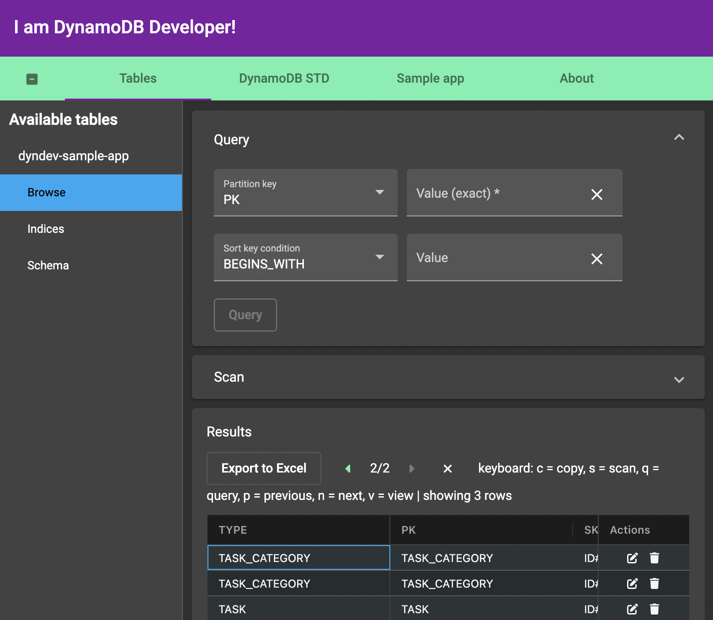
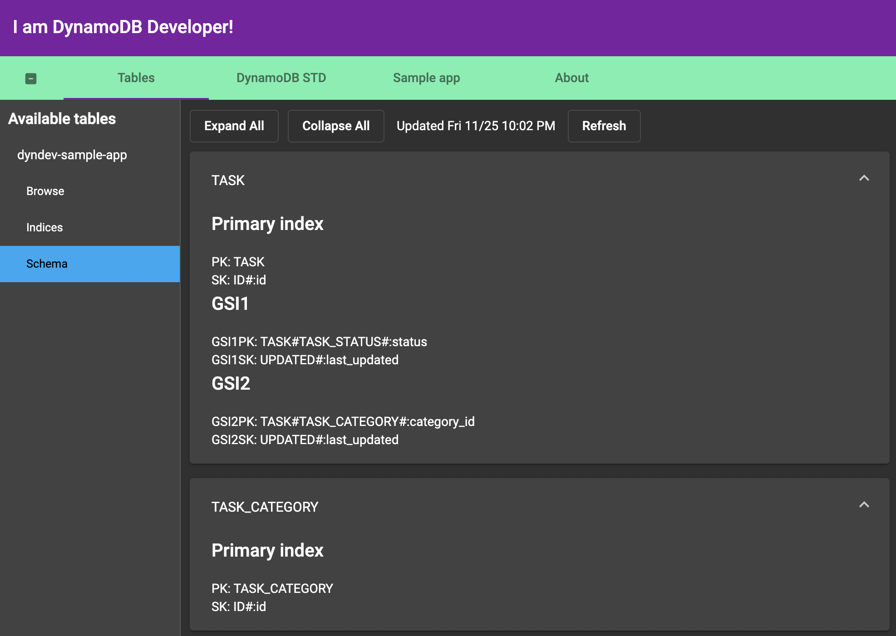
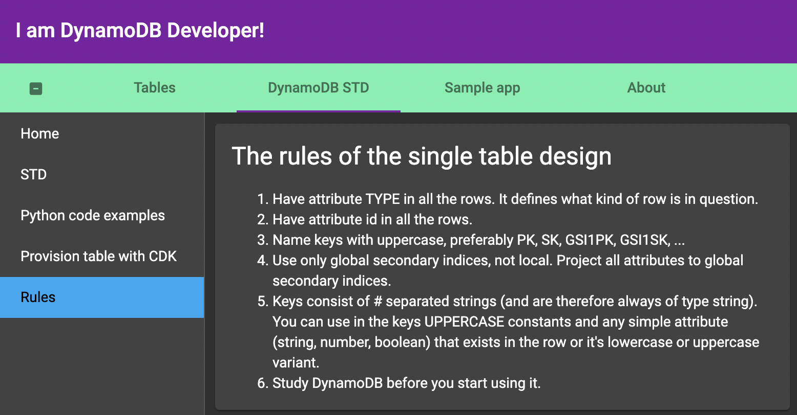

# DYNDEV

A graphical user interface client for DynamoDB developer to browse and do elementary operations with (local) DynamoDB.

NoSQL Workbench is not good software for browsing local DynamoDB in my opinion. It is especially not suitable for querying tables including data with DynamoDB [single table design](https://aws.amazon.com/blogs/compute/creating-a-single-table-design-with-amazon-dynamodb/) (STD) paradigm. This software offers also tips to do STD and superior table browsing (and editing) experience. There is also sample app using STD. Feel free to try by pulling the image from [DockerHub](https://hub.docker.com/repository/docker/stenvala/dyndev).

# What to expect

Browsing experience



Automatic schema discovery for STD



STD explained



# How to include the app in your docker-compose.yml?

For the dyndev container you define how to connect to dynamodb container in environment variables. DYNDEV_TOKEN is optional environment variable. If you give it, then the api access requires the user to enter this successfully. This is nice if you want to expose your app to e.g. public web.

Below is an example docker-compose.yml (fix the image tag to newest).

```yml
version: "3.9"
services:
  dynamo:
    image: amazon/dynamodb-local
    container_name: dynamo
    hostname: dynamo
    restart: always
    volumes:
      - ./docker/dynamodb:/dynamodb-data
    ports:
      - 8000:8000
    command: "-jar DynamoDBLocal.jar -sharedDb -dbPath /dynamodb-data"
  dyndev:
    image: stenvala/dyndev:v10
    container_name: dyndev-from-hub
    environment:
      DYNAMO_HOST: dynamo
      DYNAMO_PORT: 8000
      DYNDEV_TOKEN: <whatever-token-you-want-can-be-omitted>
      DYNDEV_LICENSE: <license-key-can-be-omitted>
    ports:
      - "17177:80"
```

# Some development help

## What's inside the container

We have there a REST API with Flask and Angular based SPA for graphical user interface that you use via browser. Nginx works as the webserver for UI and reverse proxy for API that is a systemd service which uses gunicorn with uvicorn workers. Local DynamoDB is not in the container, but you should have another container for that (in the same Docker network).

## Initialize environment

```bash
source venv.sh
cd src/ui
npm install
```

## Start services (ui and api)

```bash
python mac_start_services.py
```

## Build and push container

```bash
python  build_and_push.py
```
